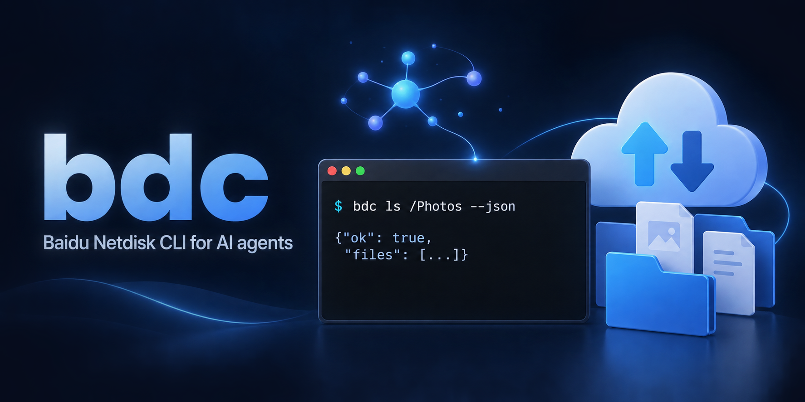

# bdc — 为 AI agent 打造的百度网盘命令行

<p><a href="README.md">English</a> · <bdi><strong>简体中文</strong></bdi></p>

<p align="center"></p>

**bdc** 即 **B**ai**d**u Netdisk **C**LI: [百度网盘](https://pan.baidu.com)的命令行客户端, 单个可执行文件, 支持 macOS、Linux、Windows.

人可以用, 但它首先是为 AI agent (Claude Code、Codex 或任何会调用工具的大模型) 设计的. agent 可以独立完成这些事:
- 找文件、看元数据;
- 下载、上传整个目录;
- 整理文件, 分享链接, 转存别人的分享.

整个过程不用解析网页, 不用猜测文本输出, 也不会被一个提示卡住.

```console
$ bdc ls --json /Photos
{
  "command": "ls",
  "files": [
    {"ctime": "2026-09-25T22:12:40+08:00", "fsId": 1043012566118829, "isDir": false,
     "md5": "b1946ac92492d2347c6235b4d2611184", "mtime": "2026-09-25T22:12:40+08:00",
     "name": "IMG_0142.jpg", "path": "/Photos/IMG_0142.jpg", "size": 3145728}
  ],
  "ok": true
}

$ bdc download --json -o ~/Downloads "/Photos/*.jpg"
{
  "command": "download",
  "files": [
    {"file": "/Users/me/Downloads/IMG_0142.jpg", "path": "/Photos/IMG_0142.jpg",
     "size": 3145728, "status": "downloaded"}
  ],
  "ok": true,
  "summary": {"downloaded": 1}
}
```

## 为什么适合 agent

| agent 需要 | bdc 的做法 |
|---|---|
| 能解析的输出 | `--json` 时 stdout **只有一份 JSON 文档**: 键有序, 大小以字节计, 时间为 RFC 3339, id 是精确整数. 进度和日志走 stderr. |
| 知道哪里错了 | 失败时有 `error: {kind, message, exitCode, code?}` 和[有含义的退出码](#退出码): 输入有误 (改参数)、未登录 (去登录)、服务器失败 (稍后重试) 等. |
| 永远不会卡住 | 没有终端时从不等待输入. 需要确认的三个命令 (`logout`, `recycle delete`, `update`) 这时要加 `-y`, 缺了 `-y` 立即报用法错误, 不会停下来提问. 其他修改 (如移入回收站的 `rm`) 直接执行, 不需要确认. |
| 保留部分进度 | 失败前已完成的工作仍在文档里: 传输中的每个文件都单独列出 `status`. |
| 可以放心重试 | 对已存在的目录 `mkdir` 算成功, 已存在的文件标为 `skipped`. 中断的下载和上传从断点继续. |
| 不用猜路径 | 下载结果给出每个文件的本地绝对路径 (`files[].file`). 通配符由 bdc 按网盘上实际存在的文件展开, 一个都没匹配到就报输入错误. |
| 只在必要时找人 | 百度风控要求安全验证 (错误码 132) 时, 没有终端的 agent 得到 `auth`/`132`. 这时你在终端里运行同一条命令, bdc 会问验证码发到哪 (短信或邮箱), 你输入验证码后它继续执行. |
| 少踩百度的坑 | bdc 按真实浏览器中观察到的方式, 说**网页版客户端**的接口. 文件操作以后台任务确认结果, 复制等操作真正完成了才会报告成功. |

**把说明书交给 agent:** [llms.txt](llms.txt) 是写给大模型的精简指南, 包括快速上手、输出格式、退出码和每个命令的规则. 例如在 `AGENTS.md` 或 `CLAUDE.md` 里加一行:

```text
操作百度网盘时用 `bdc` 并加 `--json`; 先读 https://github.com/ac1982/bdc/blob/main/llms.txt
```

## 功能

| 类别 | 命令 | 说明 |
|---|---|---|
| 帐号 | `login`, `logout`, `who`, `users`, `su`, `quota` | 用浏览器的 Cookie 登录: 从 Chrome/Edge 读取 (`--from-chrome`), 或用 `--cookies` 粘贴. 可保存多个帐号, 用 `su` 切换. |
| 浏览 | `ls`, `tree`, `meta`, `search`, `cd`, `pwd` | `ls -l` 显示 `fsId` 和 md5. 只有确实是文件内容的 md5 时才给出 `md5`. `search -r` 搜索整个子目录. 相对路径基于 `cd` 设定的目录. |
| 整理 | `mkdir`, `cp`, `mv`, `rm` | 支持通配符批量操作, 自动创建缺少的上级目录. `rm` 移入回收站, 每一项都报告是否完成. |
| 回收站 | `recycle list`, `recycle restore`, `recycle delete` | 按 `fsId` 还原. 彻底删除需要 `-y`. |
| 下载 | `download [-o 目录] [-p 连接数] [--overwrite]` | 目录递归下载, 每个文件多连接分段下载. 通过 `.bdc-part` 断点续传, 并核对远端版本. 已存在的文件跳过. |
| 上传 | `upload [--policy skip\|overwrite\|rsync] <本地…> <目录>` | 目录递归上传, 4 MiB 分块并行. 百度已有的内容秒传 (`status: "rapid"`). 支持断点续传. |
| 分享 | `share create`, `share list`, `share cancel`, `share save` | 创建带提取码和有效期的链接. `share save "<链接>?pwd=…" --to /目录` 把别人的分享转存到自己的网盘. |
| 离线下载 | `offline add`, `offline list`, `offline cancel`, `offline delete` | 百度服务器把 URL 或磁力链接下载到你的网盘. |
| 设置 | `config`, `config set`, `config reset` | 保存目录、连接数、并行文件数、限速、代理 (http/https/socks5). |
| 交互模式 | 在终端里不带参数运行 `bdc` | 命令历史, Tab 补全命令和网盘路径, 在终端里完成百度的安全验证. |
| 自更新 | `update [--check]` | 安装适合本机的最新 GitHub Release. |

每个命令用 `bdc <命令> --help` 查看参数 (加 `--json` 时也以 JSON 输出).

## 安装

```sh
go install github.com/ac1982/bdc@latest    # 需要 Go 1.26+
```

或者从 [Releases](../../releases) 下载. macOS 的 `.pkg` 安装包用 Developer ID 签名并经过 Apple 公证, 会把 `bdc` 装到 `/usr/local/bin`. 压缩包 (`.tar.gz`, Windows 为 `.zip`) 里是同一个程序, 放进 `PATH` 即可. `bdc update` 会安装更新的版本; 如果 bdc 所在目录当前用户不能写入 (例如用 `.pkg` 安装后), 请用 `sudo` 运行.

## 登录

```sh
bdc login --from-chrome                 # 或 --from-edge; 其他配置用 --profile "Profile 1"
bdc login --cookies "BDUSS=…; STOKEN=…"  # 在 pan.baidu.com 的开发者工具里复制
bdc who --json
```

在 macOS 上, `--from-chrome` 需要给终端"完全磁盘访问权限". 转存别人的分享需要 `STOKEN`. bdc 从不打印 Cookie, bdc 交互模式的历史里也从不保存 `login` 那一行. 但你自己的 shell (zsh, bash) 会记下 `bdc login --cookies …`, 所以最好用 `--from-chrome`, 或在终端里运行 `bdc login` 后在提示处粘贴 Cookie.

## 自己用

```sh
bdc ls /                                        # 给人看的输出是中文; JSON 与语言无关
bdc tree --depth 2 /Documents
bdc search -r --path / report
bdc mkdir a/b && bdc cp x.txt a && bdc mv x.txt y.txt && bdc rm "old-*"
bdc upload ~/Movies/trip.mp4 ~/Photos /Backup
bdc download -o ~/Downloads /Backup/Photos
bdc share create --days 7 /Videos/trip.mp4       # 输出链接和提取码
bdc share save "https://pan.baidu.com/s/1xxxx?pwd=abcd" --to /Saved
bdc offline add --to /Downloads "magnet:?xt=…"
bdc config set --connections 16 --download-limit 10MB
```

## 退出码

| 退出码 | `error.kind` | 含义 | agent 应该怎么做 |
|---|---|---|---|
| 0 | | 完成 | 读取字段 |
| 1 | `failed` | 服务器、网络或传输失败 | 稍后重试; 传输会续传 |
| 2 | `input` | 不存在、已存在、通配符无匹配、提取码错误 | 修正输入; 用 `bdc ls --json` 查看 |
| 3 | `dependency` | 权限问题: 读不到浏览器 Cookie, 或 `update` 不能写入 bdc 所在目录 | 改用 `--cookies` 登录; `update` 时请用户运行 `sudo bdc update` |
| 4 | `auth` | 未登录或登录已过期; `code` 为 132 时是安全验证 | `bdc login`; 132 时请用户在终端里运行该命令 |
| 64 | `usage` | 命令行有误, 或没有终端却需要确认 | 查看 `--help`; 加 `-y` |
| 130 | `cancelled` | 已取消 | 重新运行 |

## 配置

设置和帐号保存在用户配置目录的 `config.json` 中, 也可以用 `$BDC_CONFIG_DIR` 指定:
- macOS: `~/Library/Application Support/bdc`
- Linux: `~/.config/bdc`
- Windows: `%AppData%\bdc`

`bdc config --json` 显示设置和路径, 从不显示登录 Cookie.

## 开发

```sh
go vet ./... && go test -race ./...            # 单元测试, 内存中的模拟百度, 离线端到端回放
go test ./e2e -record                          # 用真实帐号重新录制端到端场景 (只动 /bdc-test)
BDC_LIVE_COOKIES="…" go test ./internal/...    # API 客户端与传输的实网测试
```

- [docs/ARCHITECTURE.md](docs/ARCHITECTURE.md) 是代码地图.
- [docs/baidu-api.md](docs/baidu-api.md) 记录了 bdc 所说的网页版协议: 文件、上传与秒传、下载签名、分享、后台任务、短信安全验证.

## 许可证

[MIT](LICENSE)
